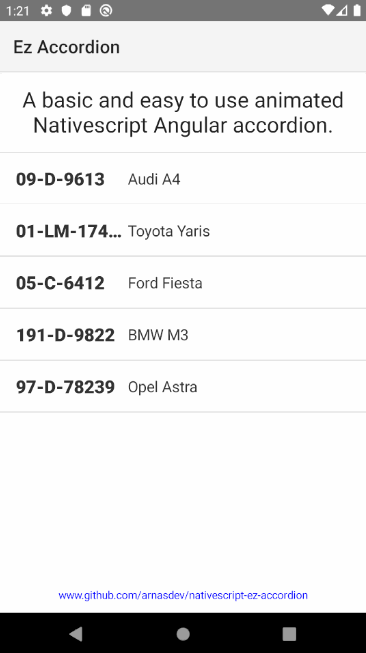

# Nativescript Ez Accordion

Ez Accordion was made to be an easy to use animated NativeScript Angular accordion. Minimal effort to get good looking accordions for mobile and easy to modify to suit your needs.

----

## Demo

----

## Preview app on device
1. Install NativeScript Preview on your mobile device

2. Go to https://play.nativescript.org/profile/projects?template=play-ng&id=nX27gj&v=7

3. Click preview and scan the QR code on your device

----

## Preview app on local environment

1. Install the latest NativeScript CLI:

> Type the following command in a Command Prompt or Terminal.

    npm install -g nativescript@latest

2. Preview your app

> Navigate to your project folder and run the following command to start previewing your app.

    tns preview

----

## Modification/Usage

#### Multiple expanded rows
By default the accordion allows only one item to be opened at a time, change this by setting:

    multi = true;

----

#### Animation properties
Customise the animation properties in the createTrigger function, documentation for these can be found here:
* https://www.w3schools.com/css/css3_animations.asp
* https://angular.io/guide/animations
* https://angular.io/guide/complex-animation-sequences

The accordion goes from 0px to rowHeight (160px default)

    return trigger('state', [
        state("inactive", style({ "height": "0px" })),
        state("active", style({ "height": AccordionComponent.rowHeight + "px" })),
        transition("inactive => active", [animate("200ms ease-out")]),
        transition("active => inactive", [animate("200ms ease-out")])
    ]);
   
   
The rowHeight is the same in the animation and html for a smooth animation but is not necessary, alternatively, the auto property can be used in NativeScript

    state("active", style({ "height": "auto" })),
    
instead of

    state("active", style({ "height": AccordionComponent.rowHeight + "px" })),

----

#### Trigger & State
Each data item in the ngFor directive has an invisible label to keep track of its state as an attribute, as opposed to an array in the Angular code.

     <Label #collapsableState [attr.state]="'inactive'" visibility="collapsed" width="0" height="0"></Label>
     
The actual thing we want to be able to show/hide then references this attribute for its animation state

    <GridLayout [@state]="collapsableState.state" width="100%" height="auto">

The trigger passes this state to the Angular code to be toggled 

    <WrapLayout (tap)="changeState(collapsableState)" width="100%">

----
## Changelog
* **12-Nov-2019:**  Initial commit
* **13-Nov-2019:**  Expanded README.md, removed unused html

